# MBTA v1 协议设计图谱与流程说明

## 0. 文档定位

本文是 MBTA v1 的图谱化设计文档，用于把协议的关键结构、状态机、数据路径、安全路径和异常路径整理成可视化图表。本文与 MBTA/1 RFC 草案、设计文档保持一致。

MBTA v1 当前冻结点：

- 帧头 `Version = 0x01`。
- `mbta/1` 是 v1 的唯一 QUIC 入口。
- `mbta/1` 使用标准 QUIC + TLS 1.3 作为强制传输安全基础。
- BATCH payload 使用 OTLP-like `SignalBatch`，包含 `resource`、`scope` 和 `signals`。
- 日志 signal 必须显式使用 `signal_type="log"`。
- 指标 signal 使用 `gauge`、`counter`、`histogram`、`summary`。
- Trace span 使用 `signal_type="span"`。
- 国密能力放在应用层：SM2 证书认证、HMAC-SM3、SM4-GCM。
- BATCH 必须使用 `SecureEnvelope`，压缩、加密、HMAC 的顺序固定。
- v1 禁止 0-RTT 发送 AUTH/BATCH。
- RFC 8998 QUIC 使用独立入口 `mbta/2`。
- TCP + NTLS/TLCP 使用独立入口 `mbta-ntls/1`。

配套文档：

- MBTA/1 设计：`docs/plan/mbta/mbta1-protocol-design.md`
- MBTA/1 RFC 草案：`docs/plan/mbta/mbta1-rfc-draft-bilingual.md`
- MBTA/2 设计：`docs/plan/mbta/mbta2-quic-rfc8998-design.md`
- MBTA/2 RFC 草案：`docs/plan/mbta/mbta2-rfc-draft-bilingual.md`
- MBTA-NTLS/1 设计：`docs/plan/mbta/mbta-ntls-tcp-tlcp-design.md`
- MBTA-NTLS/1 RFC 草案：`docs/plan/mbta/mbta-ntls1-rfc-draft-bilingual.md`
- 实施计划：`docs/plan/mbta/mbta1-implementation-plan.md`
- 测试计划：`docs/plan/mbta/mbta1-test-plan.md`
- 验证计划：`docs/plan/mbta/mbta1-verification-plan.md`

## 1. 模型修正清单

| 修正点 | 问题 | 当前规范 |
|----------|------|------------|
| “版本字段保持 0x01” | 容易误解为对旧格式做增量补丁 | `0x01` 是 MBTA/1 帧版本 |
| 单 Stream 承载控制和数据 | 控制消息会被大 BATCH 流内阻塞 | Control Stream + 至少一个 Data Stream |
| 0-RTT 携带 HELLO/AUTH/BATCH | AUTH/BATCH 有重放风险，且 BATCH key 来自 AUTH_OK | v1 禁止 0-RTT AUTH/BATCH |
| `FlagCompressed` + `BATCH.compression` | 解压前读不到 `BATCH.compression` | 压缩算法放在 `SecureEnvelope.compression` |
| BATCH 使用事件数组 | 无法表达 OTLP Resource/Scope/Logs/Metrics/Traces 分组 | BATCH payload 使用 SignalBatch |
| 日志使用空 `signal_type` | 与指标和 trace 的路由语义不一致 | 日志必须使用 `signal_type="log"` |
| SM4 密文塞进 signals | 类型破坏，互通困难 | 密文放入 `SecureEnvelope.payload` |
| HMAC 只保护 signals | seq、chunk_id、算法字段可被篡改 | HMAC 覆盖 envelope 元数据和 payload |
| WINDOW 只有 `size` | 无法控制大 batch 的字节压力 | WINDOW 同时限制 batches/signals/bytes |
| PARTIAL_ACK 只有数量 | 客户端不知道哪些 signal 失败 | 返回 rejected `event_id` 或 signal index 和 retryable |
| ACK 无 durable 语义 | 客户端不知道何时可删本地 spool | ACK 区分 `accepted` 与 `durable` |
| 直接声明满足合规 | 技术能力不等于测评结论 | 表述为“应用层国密能力，合规需测评确认” |
| `mbta/1` 同时承载标准 QUIC、RFC8998 QUIC、NTLS | 版本语义和端口边界混乱 | `mbta/1`、`mbta/2`、`mbta-ntls/1` 分别由独立文档定义 |

## 2. 总体架构模型

### 2.1 分层架构

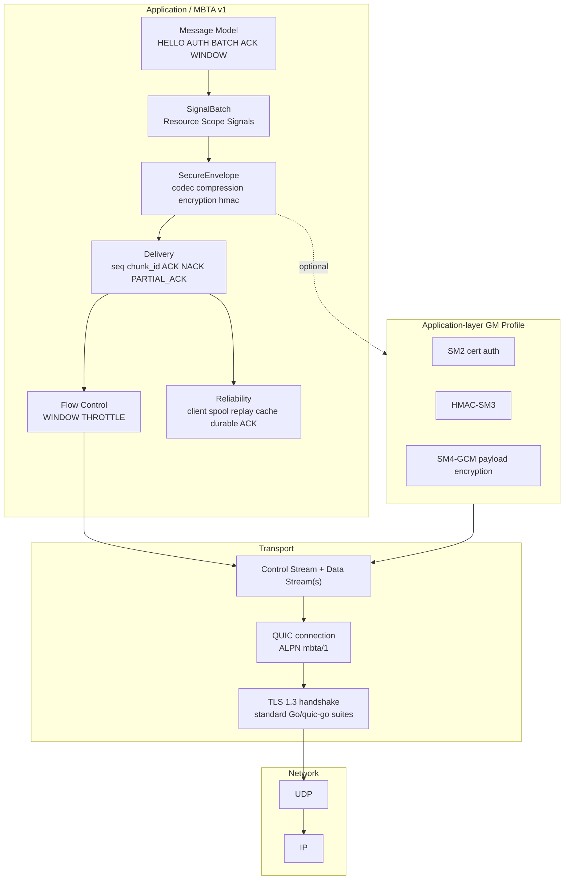

### 2.2 安全边界

```text
┌─────────────────────────────────────────────────────────────┐
│ MBTA SecureEnvelope                                          │
│                                                             │
│  ┌───────────────┐  ┌──────────────┐  ┌──────────────────┐ │
│  │ HMAC-SHA256   │  │ HMAC-SM3     │  │ SM4-GCM payload  │ │
│  │ international │  │ GM profile   │  │ optional E2E-ish │ │
│  └───────────────┘  └──────────────┘  └──────────────────┘ │
│                                                             │
│  Protects: seq, chunk_id, codec, compression, encryption,   │
│            nonce, payload, session_id, key_id               │
└─────────────────────────────────────────────────────────────┘
                              │
                              ▼
┌─────────────────────────────────────────────────────────────┐
│ QUIC + TLS 1.3                                               │
│                                                             │
│  mbta/1 uses standard TLS 1.3 transport encryption.          │
│  mbta/2 and mbta-ntls/1 are separate protocol profiles.      │
│  See mbta2-rfc-draft-bilingual.md and mbta-ntls1-rfc-draft-bilingual.md.                     │
└─────────────────────────────────────────────────────────────┘
```

### 2.3 协议入口规划

| 入口 | 传输 | 安全模型 | 端口策略 |
|------|------|----------|----------|
| `mbta/1` | QUIC + 标准 TLS 1.3 | `standard` 或 `gm_envelope` | QUIC 端口 |
| `mbta/2` | QUIC + RFC 8998 TLS 1.3 国密套件 | `gm_transport` + `hmac_sm3` | 独立设计：`mbta2-quic-rfc8998-design.md` |
| `mbta-ntls/1` | TCP + NTLS/TLCP | `gm_transport` + `hmac_sm3` | 独立设计：`mbta-ntls-tcp-tlcp-design.md` |

## 3. QUIC Stream 模型

### 3.1 标准拓扑

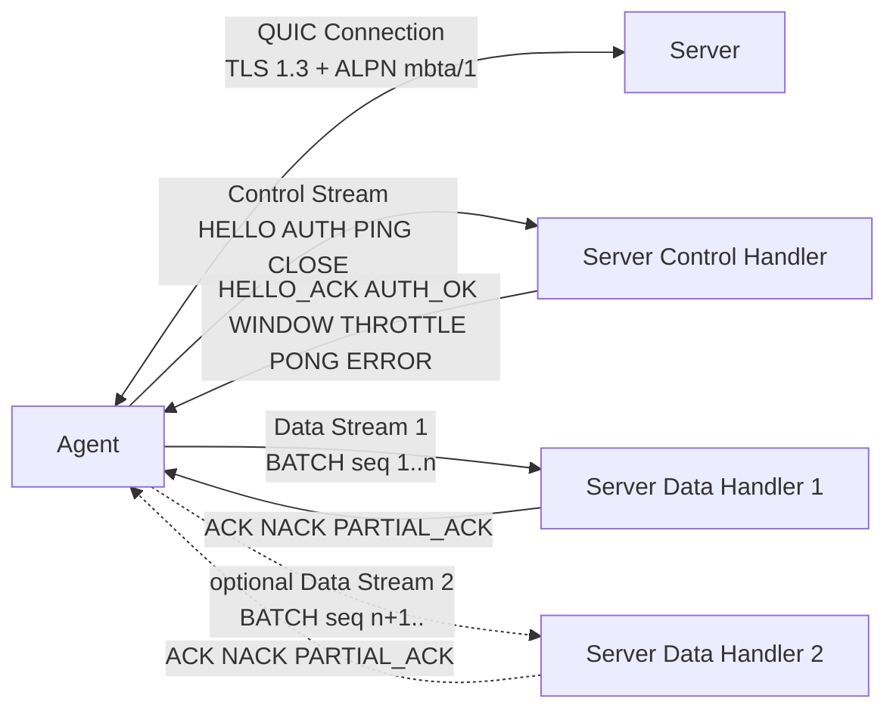

### 3.2 Stream 角色表

| Stream | QUIC 类型 | 发起方 | 消息 | 说明 |
|--------|-----------|--------|------|------|
| Control Stream | bidirectional | Agent | HELLO、AUTH、WINDOW、THROTTLE、PING、PONG、CLOSE、ERROR | 连接控制面 |
| Data Stream | bidirectional | Agent | BATCH、ACK、NACK、PARTIAL_ACK | 数据投递面 |
| Extra Data Stream | bidirectional | Agent | BATCH、ACK、NACK、PARTIAL_ACK | 需协商 `multi_data_stream` |

### 3.3 关键规则

- 第一条由 Agent 打开的双向 stream 是 Control Stream。
- 认证完成前不得打开 Data Stream 发送 BATCH。
- Control Stream 上不得发送 BATCH。
- Data Stream 上不得发送 HELLO/AUTH。
- 多 Data Stream 启用后，ACK 可以乱序返回。
- `seq` 是 session 级全局递增，不是 stream 局部递增。

## 4. 帧模型

### 4.1 16 字节帧头

```text
0                   1                   2                   3
0 1 2 3 4 5 6 7 8 9 0 1 2 3 4 5 6 7 8 9 0 1 2 3 4 5 6 7 8 9 0 1
+-------------------------------+-------+-------+---------------+
| Magic "MBTA"                  | Ver   | Flags | Type          |
+-------------------------------+-------+-------+---------------+
| Length                                                        |
+---------------------------------------------------------------+
| CRC32(payload)                                                |
+---------------------------------------------------------------+
| Payload ...                                                   |
+---------------------------------------------------------------+
```

### 4.2 字段表

| Offset | Size | Field | 值/类型 | 说明 |
|--------|------|-------|---------|------|
| 0 | 4 | Magic | ASCII `MBTA` | 快速识别协议 |
| 4 | 1 | Version | `0x01` | MBTA v1 |
| 5 | 1 | Flags | bitset | 帧级标志 |
| 6 | 2 | Type | uint16 BE | 消息类型 |
| 8 | 4 | Length | uint32 BE | payload 字节数 |
| 12 | 4 | CRC32 | IEEE CRC32 | payload 快速校验 |

### 4.3 Flags

| Bit | Mask | Name | 说明 |
|-----|------|------|------|
| 0 | `0x01` | `FlagEnvelope` | payload 是 SecureEnvelope JSON |
| 1 | `0x02` | `FlagControl` | 控制面消息 |
| 2 | `0x04` | `FlagData` | 数据面消息 |
| 3 | `0x08` | `FlagMoreFollows` | v1 预留，不实现 |
| 4-7 | - | Reserved | 必须为 0 |

修正点：

- 帧 flags 不再描述压缩算法。
- 压缩、加密、HMAC 算法均在 SecureEnvelope 中声明。
- `FlagMoreFollows` v1 不允许发送。

## 5. 消息注册表

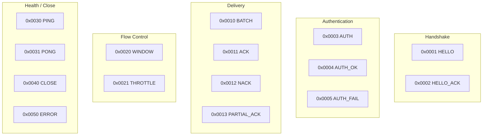

## 6. 能力协商模型

### 6.1 能力选择流程

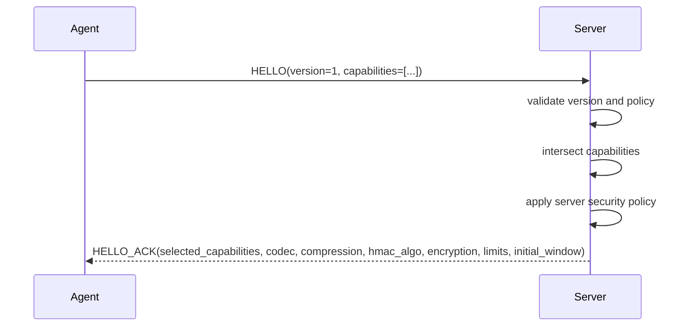

### 6.2 选择结果不是简单交集

```text
client capabilities
      │
      ▼
intersection with server capabilities
      │
      ▼
server policy filter
      │
      ├─ require durable_ack?
      ├─ require hmac?
      ├─ require sm2_cert_auth?
      ├─ allow compression?
      └─ allow sm4_gcm?
      │
      ▼
selected capabilities + concrete algorithms
```

### 6.3 关键 capability

| Capability | 说明 | v1 建议 |
|------------|------|---------|
| `codec_json` | JSON 编码 | 必须 |
| `signal_batch_v1` | OTLP-like SignalBatch payload | 必须 |
| `compress_gzip` | gzip 压缩 | 建议 |
| `hmac_sha256` | HMAC-SHA256 | 建议 |
| `hmac_sm3` | HMAC-SM3 | 国密 profile |
| `sm4_gcm` | SM4-GCM payload encryption | 国密 profile |
| `sm2_cert_auth` | SM2 证书认证 | 国密 profile |
| `partial_ack` | 部分成功 | 建议 |
| `window_flow_control` | 应用层窗口 | 建议 |
| `throttle` | 显式节流 | 建议 |
| `durable_ack` | durable ACK | 生产建议 |
| `multi_data_stream` | 多 Data Stream | 可选 |

## 7. 连接生命周期

### 7.1 正常连接流程

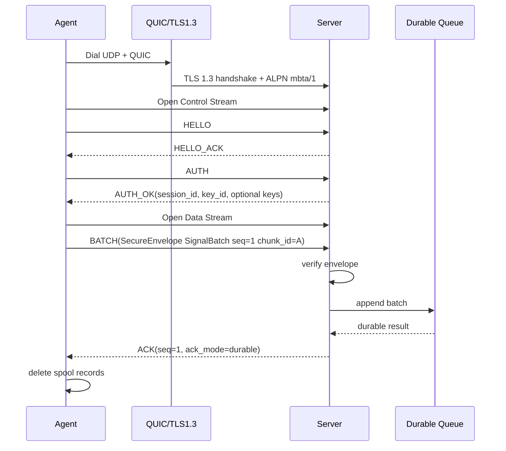

### 7.2 v1 禁止的 0-RTT 业务流程

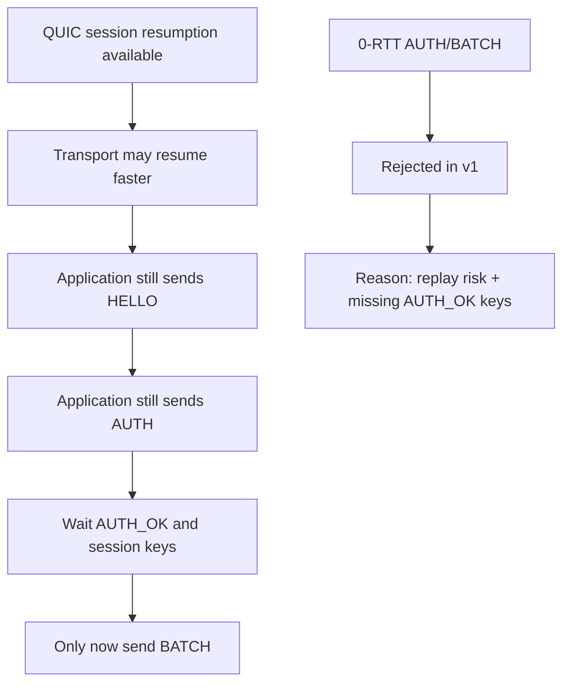

## 8. SecureEnvelope 模型

### 8.1 Envelope 结构图

```text
SecureEnvelope
├── envelope_version
├── message_type = "batch"
├── session_id
├── key_id
├── seq
├── chunk_id
├── created_at_unix_ms
├── codec              ─┐
├── compression         │ visible before decoding payload
├── encryption          │
├── hmac_algo          ─┘
├── nonce
├── payload = Base64(encoded/compressed/encrypted bytes)
└── mac = Base64(HMAC(canonical signing string))
```

### 8.2 发送处理流水线

```mermaid
flowchart LR
    B["SignalBatch<br/>resource scope signals"] --> C["codec encode<br/>JSON v1"]
    C --> D{"compression?"}
    D -->|"none"| E["encoded bytes"]
    D -->|"gzip"| G["gzip bytes"]
    E --> H{"encryption?"}
    G --> H
    H -->|"none"| P["payload bytes"]
    H -->|"sm4_gcm"| X["SM4-GCM Seal<br/>nonce + AAD"]
    X --> P
    P --> B64["Base64 payload"]
    B64 --> ENV["fill SecureEnvelope metadata"]
    ENV --> MAC{"hmac_algo?"}
    MAC -->|"none"| OUT["JSON envelope"]
    MAC -->|"sha256/sm3"| SIGN["canonical signing string"]
    SIGN --> HM["HMAC"]
    HM --> OUT
    OUT --> FRAME["MBTA frame<br/>FlagEnvelope + FlagData"]
```

### 8.3 接收处理流水线

```mermaid
flowchart LR
    FRAME["Read frame"] --> CRC["CRC32 check"]
    CRC --> ENV["Decode SecureEnvelope JSON"]
    ENV --> ALG["Validate algorithms and session"]
    ALG --> MAC{"HMAC enabled?"}
    MAC -->|"yes"| VM["Verify MAC first"]
    MAC -->|"no"| B64["Base64 decode payload"]
    VM --> B64
    B64 --> ENC{"encrypted?"}
    ENC -->|"sm4_gcm"| DEC["SM4-GCM Open<br/>with AAD"]
    ENC -->|"none"| COMP{"compressed?"}
    DEC --> COMP
    COMP -->|"gzip"| GUNZIP["gzip decompress with limits"]
    COMP -->|"none"| CODEC["codec decode"]
    GUNZIP --> CODEC
    CODEC --> BATCH["SignalBatch"]
    BATCH --> CHECK["seq/chunk_id match envelope"]
    CHECK --> VALID["signal validation"]
    VALID --> RESULT["ACK / NACK / PARTIAL_ACK"]
```

### 8.4 Canonical signing string

```text
mbta-v1
message_type=batch
session_id=<session_id>
key_id=<key_id>
seq=<seq decimal>
chunk_id=<chunk_id>
created_at_unix_ms=<created_at_unix_ms decimal>
codec=<codec>
compression=<compression>
encryption=<encryption>
hmac_algo=<hmac_algo>
nonce=<nonce>
payload=<payload base64>
```

HMAC 修正点：

- 不对 JSON map marshal 结果直接签名。
- 不只保护 signals。
- 必须保护算法字段和路由前关键元数据。
- 比较 MAC 必须使用常量时间比较。

### 8.5 SignalBatch 与 OTLP 映射结构

```text
SignalBatch
├── schema_url
├── resource
│   ├── service.name
│   ├── host.name
│   ├── agent.id
│   └── tenant.id
├── scope
│   ├── name
│   ├── version
│   └── collector_id
└── signals
    ├── signal_type = "log"
    │   ├── body
    │   ├── severity_number / severity_text
    │   └── trace_id / span_id
    ├── signal_type = "gauge" | "counter" | "histogram" | "summary"
    │   ├── metric_name
    │   ├── metric_fields
    │   ├── unit
    │   ├── temporality
    │   └── is_monotonic
    └── signal_type = "span"
        ├── trace_id / span_id / parent_span_id
        ├── name / kind
        ├── start_time_unix_ms / end_time_unix_ms
        └── status_code / status_message

OTLP mapping:
  resource -> Resource
  scope    -> InstrumentationScope
  log      -> Logs LogRecord
  metric   -> Metrics data point
  span     -> Traces Span
```

## 9. 压缩、加密、HMAC 顺序

### 9.1 顺序总图

```text
Plain SignalBatch
      │
      ▼
JSON codec
      │
      ▼
gzip / none
      │
      ▼
SM4-GCM / none
      │
      ▼
Base64 payload
      │
      ▼
HMAC-SHA256 / HMAC-SM3 / none
      │
      ▼
SecureEnvelope JSON
      │
      ▼
MBTA frame
```

### 9.2 SM4-GCM AAD 模型

```text
AAD = "mbta-v1|batch|<session_id>|<key_id>|<seq>|<chunk_id>|<codec>|<compression>|<encryption>"

SM4-GCM input:
  key        = session sm4_key
  nonce      = 12 random bytes, unique under key_id
  plaintext  = compressed payload bytes
  aad        = envelope binding data

SM4-GCM output:
  ciphertext || tag
```

### 9.3 国密能力模型

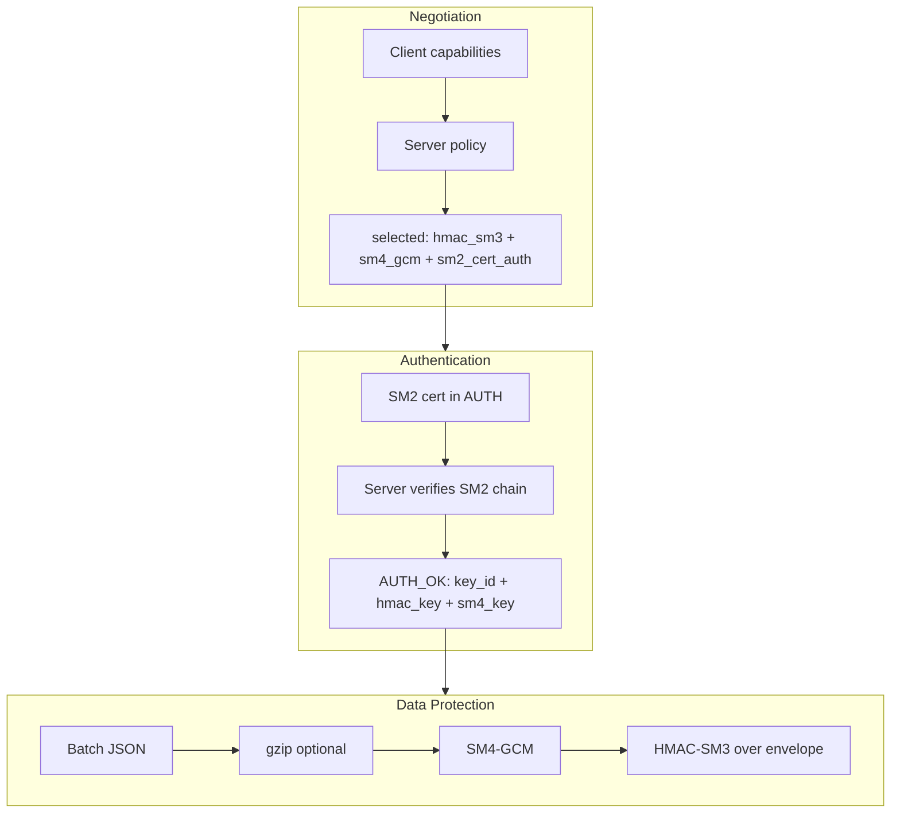

## 10. ACK/NACK/PARTIAL_ACK 模型

### 10.1 ACK 决策流程

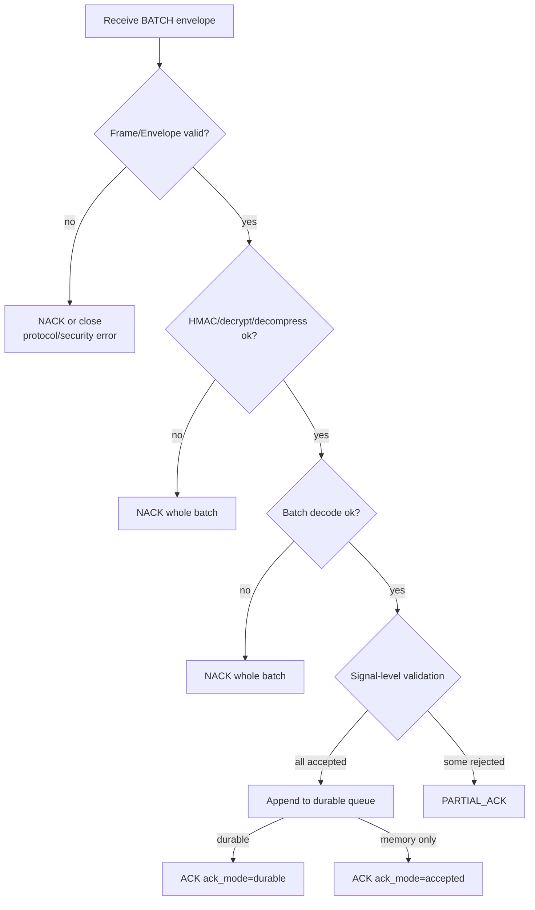

### 10.2 PARTIAL_ACK 语义

```text
Original batch signals:
  index 0  event_id=log-1     accepted
  index 1  event_id=cpu-1     accepted
  index 2  event_id=metric-2  rejected retryable=false
  index 3  event_id=span-3    rejected retryable=true

PARTIAL_ACK:
  rejected:
    - event_id: metric-2, index: 2, code: ERR_SIGNAL_TOO_LARGE, retryable: false
    - event_id: span-3, index: 3, code: ERR_SERVER_OVERLOADED, retryable: true

Client action:
  - delete accepted signals if ack_mode=durable
  - move metric-2 to dead-letter
  - retry span-3 in a new batch with new seq and chunk_id
```

### 10.3 ACK 类型对客户端 spool 的影响

| Response | ack_mode | 客户端行为 |
|----------|----------|------------|
| ACK | durable | 删除该 batch 对应 spool records |
| ACK | accepted | 若 `durable_required=false` 可删除，否则继续保留 |
| PARTIAL_ACK | durable | 删除 accepted signals，处理 rejected signals |
| NACK retryable | - | 保留 batch，退避重试 |
| NACK non-retryable | - | 写 dead-letter 或按策略丢弃 |

## 11. 可靠性模型

### 11.1 Client spool 状态机

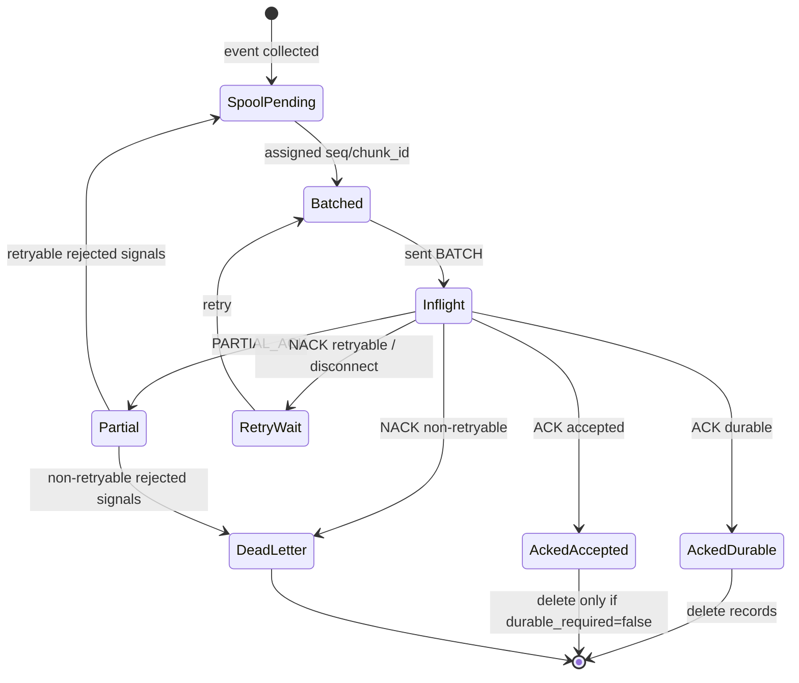

### 11.2 Replay cache 状态机

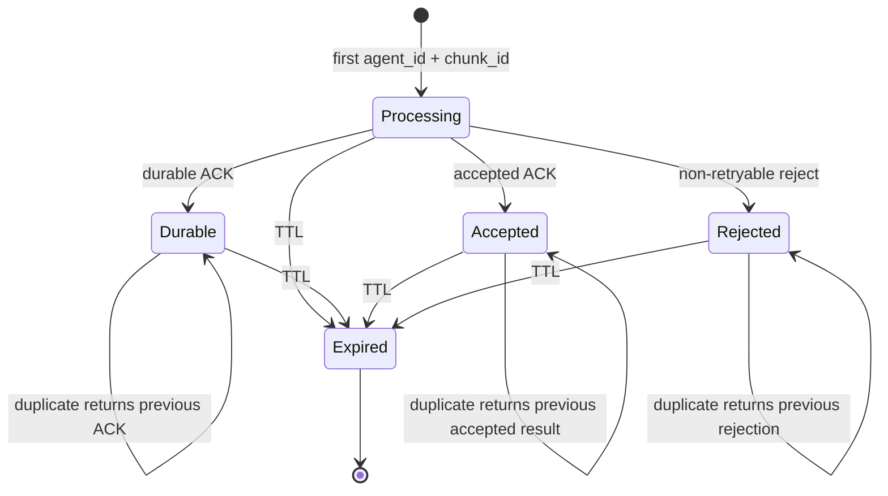

### 11.3 去重键

```text
single-tenant:
  replay_key = agent_id + chunk_id

multi-tenant:
  replay_key = tenant_id + agent_id + chunk_id
```

## 12. 流控与节流模型

### 12.1 三维 WINDOW

```text
WINDOW
├── max_inflight_batches
├── max_inflight_signals
└── max_inflight_bytes
```

发送条件：

```text
now >= throttle_until
AND inflight_batches + next_batch_batches <= max_inflight_batches
AND inflight_signals + next_batch_signals <= max_inflight_signals
AND inflight_bytes   + next_batch_bytes   <= max_inflight_bytes
```

### 12.2 流控流程

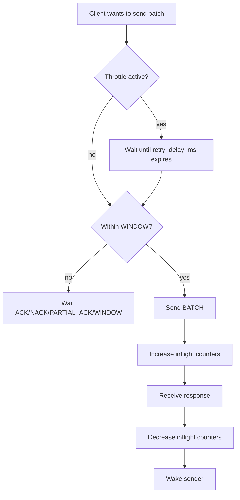

### 12.3 服务端窗口调整

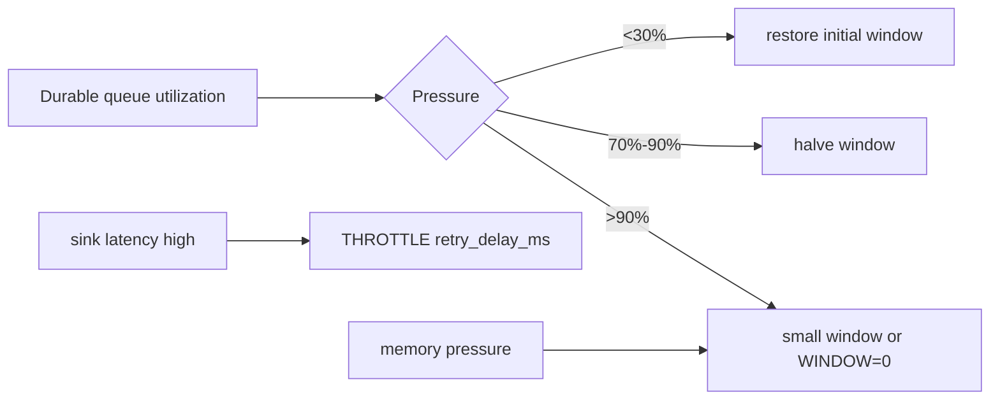

## 13. 状态机

### 13.1 客户端状态机

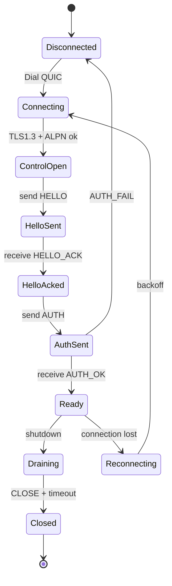

### 13.2 服务端状态机

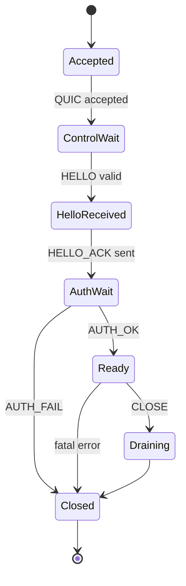

## 14. 错误处理流程

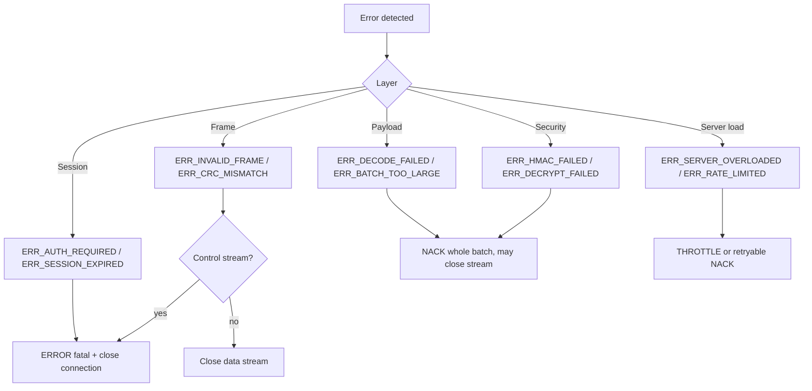

## 15. 配置模型

### 15.1 服务端配置关系

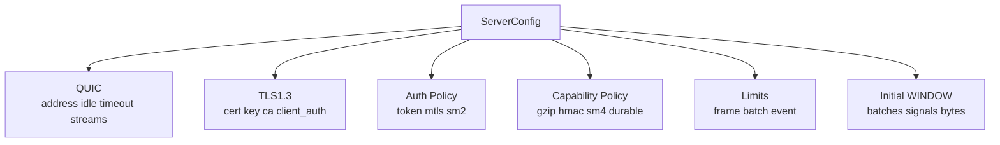

### 15.2 客户端配置关系

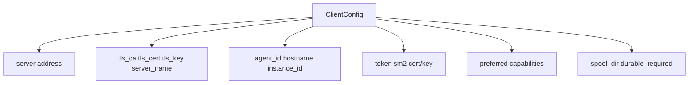

## 16. 完整端到端路径

### 16.1 最小安全路径

```text
QUIC TLS1.3 + ALPN mbta/1
  -> Control Stream
  -> HELLO / HELLO_ACK
  -> AUTH token / AUTH_OK
  -> Data Stream
  -> BATCH SecureEnvelope(SignalBatch)
  -> gzip optional
  -> HMAC-SHA256
  -> durable queue
  -> ACK durable
  -> client deletes spool
```

### 16.2 国密应用层路径

```text
QUIC TLS1.3 + ALPN mbta/1
  -> HELLO selected: hmac_sm3 + sm4_gcm + sm2_cert_auth
  -> AUTH token + SM2 cert
  -> AUTH_OK key_id + hmac_key + sm4_key
  -> SignalBatch JSON
  -> gzip
  -> SM4-GCM with AAD
  -> HMAC-SM3 over envelope
  -> durable ACK
```

### 16.3 独立传输 profile 路径

```text
mbta/2:
  RFC 8998 QUIC + ALPN mbta/2
  -> HELLO selected: hmac_sm3, encryption=none by default
  -> AUTH SM2 transport identity or mapped app identity
  -> BATCH SecureEnvelope(SignalBatch)
  -> HMAC-SM3 over envelope
  -> durable ACK

mbta-ntls/1:
  TCP + NTLS/TLCP on a separate TCP port
  -> MBTA frame/message/session semantics
  -> hmac_sm3, encryption=none by default
  -> durable ACK
```

### 16.4 断线恢复路径

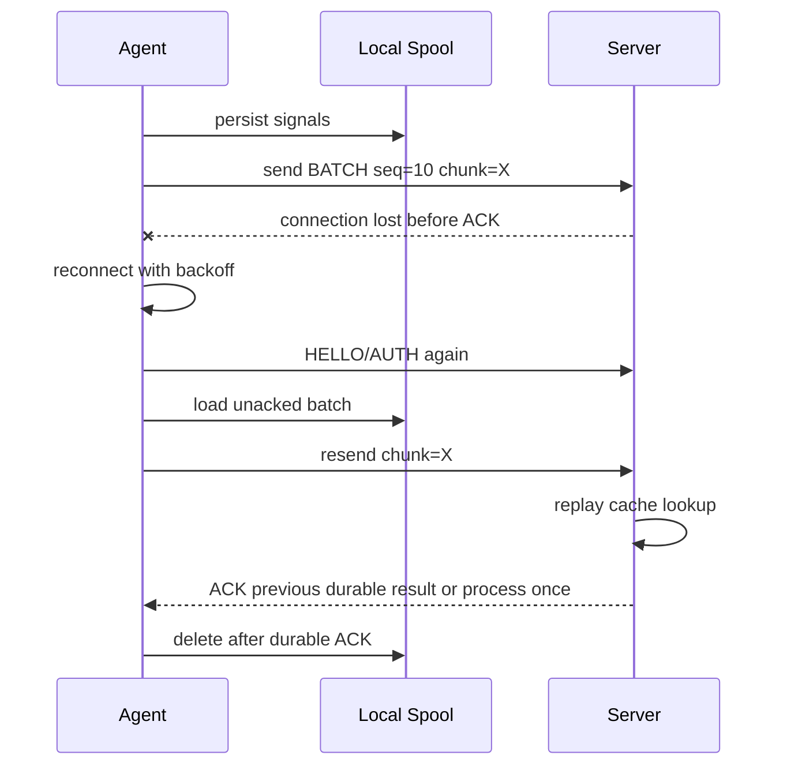

## 17. 多 Data Stream 模型

```mermaid
flowchart TB
    subgraph CLIENT["Agent"]
        Q["send queue"]
        PICK["stream picker<br/>hash tag/source"]
        M["inflight map<br/>chunk_id -> batch"]
    end

    subgraph STREAMS["QUIC Data Streams"]
        S1["Data Stream 1"]
        S2["Data Stream 2"]
        S3["Data Stream 3"]
    end

    subgraph SERVER["Server"]
        H1["handler 1"]
        H2["handler 2"]
        H3["handler 3"]
        R["durable queue"]
    end

    Q --> PICK
    PICK --> S1
    PICK --> S2
    PICK --> S3
    S1 --> H1
    S2 --> H2
    S3 --> H3
    H1 --> R
    H2 --> R
    H3 --> R
    H1 -.->|"ACK chunk_id"| M
    H2 -.->|"ACK chunk_id"| M
    H3 -.->|"ACK chunk_id"| M
```

规则：

- ACK 不依赖 stream 顺序。
- 客户端按 `chunk_id` 关联 ACK。
- 同一 ordering key 如需顺序，固定到同一 Data Stream。

## 18. 威胁模型图

```mermaid
flowchart TB
    NET["Network attacker"] -->|sniff/tamper| TLS["QUIC TLS1.3"]
    TLS -->|mitigates| E1["transport confidentiality/integrity"]

    MITM["MITM with bad cert"] --> CERT["certificate validation"]
    CERT --> E2["reject if CA/SNI invalid"]

    REPLAY["Replay old batch"] --> RC["replay cache<br/>agent_id + chunk_id"]
    RC --> E3["dedupe / previous ACK"]

    TAMPER["Modify envelope fields"] --> HMAC["HMAC canonical string"]
    HMAC --> E4["MAC failure"]

    LOAD["Slow server / sink"] --> FLOW["WINDOW + THROTTLE"]
    FLOW --> E5["backpressure"]

    ZIP["Compression bomb"] --> LIMIT["decompressed size limits"]
    LIMIT --> E6["NACK / reject"]
```

## 19. 实施阶段总图

```mermaid
gantt
    title MBTA v1 Implementation Roadmap
    dateFormat  YYYY-MM-DD
    axisFormat  %m-%d
    section Core
    Frame + Message Core       :p1, 2026-05-26, 5d
    QUIC + TLS1.3 Transport    :p2, after p1, 6d
    Session + Auth             :p3, after p2, 5d
    SignalBatch + Delivery Core :p4, after p3, 5d
    section Security
    SecureEnvelope + gzip + HMAC-SHA256 :p5, after p4, 6d
    Spool + Flow Control + Partial ACK  :p6, after p5, 8d
    SM2 + SM3 + SM4 GM Profile          :p7, after p6, 8d
    section Production
    Multi Stream + OTLP Mapping + Fuzz   :p8, after p7, 7d
```

## 20. 最终设计决策

1. `Version=0x01` 是 MBTA/1 帧版本。
2. `mbta/1` 的唯一传输层是标准 QUIC + TLS1.3；`mbta/2` 和 `mbta-ntls/1` 使用独立设计和 RFC 草案文档描述。
3. v1 使用 Control Stream + 至少一个 Data Stream。
4. v1 禁止 0-RTT 发送 AUTH/BATCH。
5. BATCH payload 必须使用 SignalBatch，并通过 SecureEnvelope 承载。
6. 压缩算法在 envelope 中声明，不在被压缩的业务 JSON 中声明。
7. SM4-GCM 密文放在 envelope payload 中，不塞进 signals。
8. HMAC 覆盖 envelope 元数据和 payload。
9. PARTIAL_ACK 必须返回 rejected `event_id` 或 signal index。
10. WINDOW 同时限制 batches、signals、bytes。
11. durable ACK 是生产可靠投递的推荐语义。
12. SignalBatch 必须可无损映射为 OTLP Logs、Metrics、Traces。
13. 国密是应用层能力路径，最终合规需结合密码产品、密钥管理、证书体系和测评结论。
